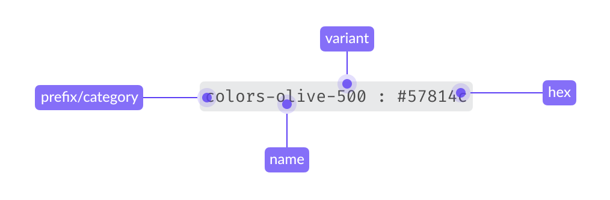

# Definition and Structure

## 1. What are design tokens?

Design tokens are the smallest units that store the visual guidelines and design
decisions that characterize our system. More importantly, tokens document the
intended context of use assigned to a specific style, and enable the application
of the correct visual value to a specific component property. This is how tokens
help to bridge the gap between implementation and design.

Tokens are used to:

1. **Define the visual style of components**: since tokens capture the system’s
stylistic attributes, they provide guidance to define the styles (background
colors, text formatting, sizes, spacing…) of new system components from scratch.

2. **Codify design styles**: Designers use tokens to specify all the visual
styles and interactive properties of a given component. These design decisions
are translated to code. For more details regarding the use of design tokens for
design specification, refer to the section dedicated to specification
hand-off to development in the [Designing Components](../contributing/designing-new-components.md)
documentation.

### From visual styles to tokens in design and code
Design system components are made up of a combination of predefined perceptual
patterns. These patterns result from the consistent application of preselected
styles such as colors, shadows, or spacing values, to specific UI elements and
properties like backgrounds, borders, or paddings.

At its core, Atlas is made up of a set of visual styles derived from the
[style guide](../style-guide/overview) principles. Colors, typography, shadows
and spacings are aligned with the style guide, and documented as tokens in the
system. Design tokens are thus the smallest building blocks of the system: they
define, document and enable the application of systemic design decisions at
scale.

### Token typologies

There are three types of tokens, depending on their function and level of
abstraction:

#### global tokens
Option tokens are context-agnostic tokens that encapsulate the primitive visual
foundations of the system. Their name does not reflect a specific use case,
rather they use the simplest possible name. They have raw values, e.g.
`olive-500: #57814c`

Global tokens are not used to style components. Their only purpose is to
document raw values, and to be consumed by the next token typology: theme
tokens.

::: warning Prefix only in Figma
In Figma, Colors and Typography are used as prefixes to organize design tokens, but these prefixes are typically removed when the tokens are transformed into CSS variables
:::

#### Theme tokens

Theme tokens consume global tokens as values. They represent design decisions
that can be reused to style system components. For this reason, theme tokens
are documented in our [Theme token demo](../style-guide/theme.md). They communicate their
intended use case via their name (so are not agnostic, like option tokens), e.g.
`border-color-accent`.

Decision tokens are used to style system components and elements.

#### Component decision tokens
In the context of Atlas, component tokens are used to document and define
specific component styles that cannot be documented as shared decisions due to
their single-use application. The names of component tokens include the name of
the specific component and the property they define. Like decision tokens, they
consume option tokens as values, e.g. `color-link-visited: purple-600`.

Component tokens embody exceptions, and are directly applied to style specific
component properties. If a pattern arises (i.e. the component token can be used
by several components), the  single-use component token can be converted into a
theme token.

## 2. Tokens in design

### From design to implementation
Designers can access an overview of Atlas foundational styles and principles, along with their token translation, in the
[Atlas Figma library](https://www.figma.com/design/2vheURjyvYg2oyBeuQOxQ1/%F0%9F%92%A0-Atlas---Design-System?m=auto&t=zXhsNI5KObVWIEyg-1). By enabling this library in their project’s Figma files,
designers can reuse the Atlas visual principles as Figma styles and variables when creating components and compositions.

::: info
Please note that tokens are context-specific: use them accordingly to the
intended purpose expressed by their name. E.g. Apply content colors only to
text.
:::

During implementation, engineers will be able to follow the design
specifications in Figma (whether these are presented explicitly, or via the
Inspect panel) and use the correct design tokens as values of the component’s
CSS properties.

Please find all current design system token category demos in this section of
the Atlas docs, starting at [Border](border.md) and ending at
[Spacing](spacing.md).