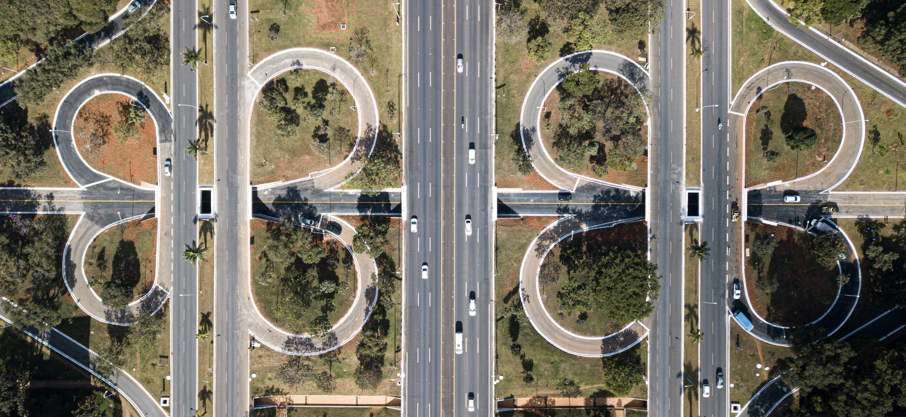

# Images

Images play an important role in enhancing understanding and engagement within OpenStreetMap projects. They appear both as standalone visual content and as supportive elements that help communicate ideas more clearly.

 

  

#### Image Selection Guidelines

When selecting or contributing images for the Atlas design system or any OpenStreetMap-related materials, we follow some core principles:

* **Contextually relevant** – Images should be directly related to the topic they illustrate. For example, content about bike lanes should include relevant imagery of cyclists, infrastructure, or signage that supports and enriches the information.
* **Neutral point of view** – Visuals should maintain objectivity. Avoid dramatized or emotionally charged images unless clearly needed for context.
* **Use the most accurate medium** – Use realistic photos when representing real-world objects, places, or people. Illustrations or icons should be used intentionally to simplify or symbolize concepts.
* **High resolution and quality** – Images should be clear, well-composed, and optimized for both print and screen use.
* **Respect for copyright** – Only use media with the proper license. Prefer Creative Commons, Public Domain, or materials hosted on [Wikimedia Commons](https://commons.wikimedia.org/) and other open-license platforms that comply with copyright guidelines.

::: warning Important
We don't have an official illustration library in Atlas yet, but you can help change that! If you'd like to contribute illustrations aligned with our design system, visit our [GitHub](https://github.com/Gustavo22Soaresh/Design-Atlas) and share your ideas. All contributions are welcome!
:::